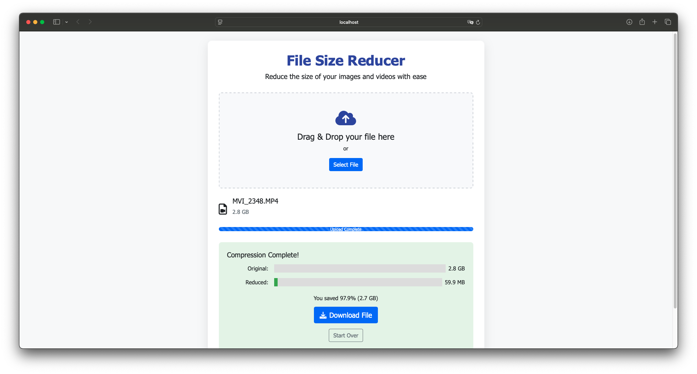

# 🗜️ File Size Reducer

A powerful web application that compresses your images and videos while maintaining quality. Perfect for reducing file sizes for web uploads, email attachments, or saving storage space.


## 📱 Screenshot



## ✨ What This App Does

- **Shrink Images**: Compress JPEG, PNG, WebP, and GIF files by up to 80% while keeping them looking great
- **Compress Videos**: Reduce MP4, AVI, MOV, MKV, and WMV file sizes using professional FFmpeg encoding
- **Smart Processing**: Automatically detects file types and applies optimal compression settings
- **Instant Download**: Process and download your compressed files immediately
- **No Registration**: Upload, compress, download - that's it!

## 🚀 Quick Start

### Option 1: Run Locally (Recommended for development)

#### Step 1: Install Python Requirements
```bash
# Clone the repository
git clone <your-repo-url>
cd file-size-reducer

# Install Python dependencies
pip install -r requirements.txt
```

#### Step 2: Install FFmpeg (Required for video compression)
**On macOS:**
```bash
brew install ffmpeg
```

**On Ubuntu/Debian:**
```bash
sudo apt update
sudo apt install ffmpeg
```

**On Windows:**
- Download from [https://ffmpeg.org/download.html](https://ffmpeg.org/download.html)
- Extract and add to your PATH environment variable

#### Step 3: Run the Application
```bash
python3 app.py
```

#### Step 4: Open Your Browser
Go to [http://localhost:8080](http://localhost:8080)

### Option 2: Run with Docker (Easiest setup)

```bash
# Build and run with Docker Compose
docker-compose up --build

# Open your browser to http://localhost:8080
```

## 📋 System Requirements

- **Python**: 3.8 or higher
- **FFmpeg**: Latest version (for video compression)
- **RAM**: 2GB minimum (4GB+ recommended for large files)
- **Storage**: At least 2x the size of your largest file for processing

## 🎛️ How to Use

1. **Upload**: Drag & drop or click to select your image/video file
2. **Adjust Settings**: 
   - **Images**: Set quality (1-100) and resize factor (0.1-1.0)
   - **Videos**: Set CRF value (18-38, lower = better quality)
3. **Compress**: Click the compress button and wait
4. **Download**: Your compressed file downloads automatically

## 🔧 Customization

### Supported File Types
- **Images**: `.png`, `.jpg`, `.jpeg`, `.gif`, `.webp`
- **Videos**: `.mp4`, `.avi`, `.mov`, `.mkv`, `.wmv`  
- **Documents**: `.pdf`, `.doc`, `.docx`, `.ppt`, `.pptx`, `.xls`, `.xlsx` (copied as-is)

### Configuration
Edit `config.py` to modify:
- Maximum file size (default: 10GB)
- Allowed file extensions
- Upload/processed folder locations

## 🐛 Troubleshooting

**Problem**: "FFmpeg not found" error
- **Solution**: Make sure FFmpeg is installed and in your system PATH

**Problem**: Large videos take forever to process
- **Solution**: This is normal! Video compression is CPU-intensive. Consider using a higher CRF value (28-32) for faster processing.

**Problem**: "Permission denied" errors on file deletion
- **Solution**: Make sure the uploads/ and processed/ folders have write permissions

**Problem**: App crashes with large files
- **Solution**: Increase your system's available RAM or compress smaller files

## 🤝 Contributing

1. Fork the repository
2. Create a feature branch (`git checkout -b amazing-feature`)
3. Commit your changes (`git commit -m 'Add amazing feature'`)
4. Push to the branch (`git push origin amazing-feature`)
5. Open a Pull Request

## 📄 License

This project is licensed under the MIT License - see the [LICENSE](LICENSE) file for details.

## 🙋‍♂️ Support

If you find this project helpful, please give it a ⭐ on GitHub!

For issues or questions, please open an issue in the repository.